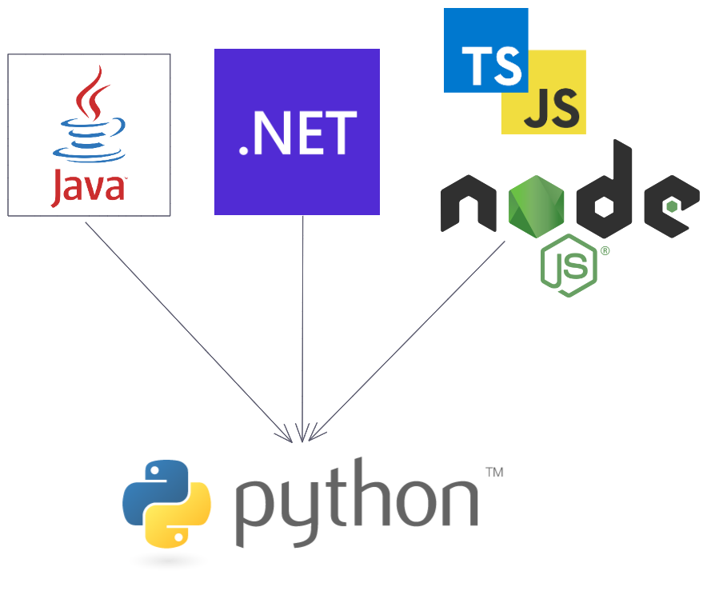

# SFEIR Python 🐍 Academy 📚

> A practical training program, to learn Python, when coming from a Java, .NET or Node.js Developer background.

 

 

[Discover the SFEIR Schools](https://www.sfeir.com/fr/le-contenus-dexperts-de-la-technologie-et-de-linnovation/formation-gratuite-avec-nos-experts/)

# Slides

You can view the slides [here](https://sfeir-open-source.github.io/sfeir-python-academy/).

## Develop

To run docs locally, simply run `npm run start`, and open slides on http://localhost:4200/.

## Workshop

Workshops are in directory `labs` :

- two directories per workshop :
  - one with a README.md with workshop steps and source file to complete
  - a second directory suffixed with `-solution` which contains source file with solutions.

## Contributing

### Contributing Guidelines

Read through our [contributing guidelines][contributing] to learn about our submission process, coding rules and more.

### Want to Help?

Want to file a bug, contribute some code, or improve documentation? Excellent! Read up on our guidelines for [contributing][contributing] and then check out one of our issues labeled as <kbd>help wanted</kbd> or <kbd>good first issue</kbd>.

### Code of Conduct

Help us keep Angular open and inclusive. Please read and follow our [Code of Conduct][codeofconduct].

[contributing]: CONTRIBUTING.md
[codeofconduct]: https://github.com/sfeir-open-source/code-of-conduct/blob/master/CODE_OF_CONDUCT.md
