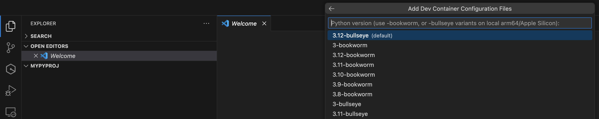

# Lab 01: Creating a new Python Project

This lab will show how to create a Python project in `VSCode`. We will be using `Dev Containers` to install `python`

## 0. Setup `VSCode` for development within Docker Containers (DevContainers)

1. Go to `Extensions` panel
2. Search for `Dev Containers` and install it

## 1. Creating an empty Python Project

1. Create a folder named `mypyproj` and open it with VSCode
2. Type **<kbd>CMD</kbd>+ <kbd>SHIFT</kbd> + <kbd>P</kbd>** -> "Dev Containers : New Dev Container Configuration Files..."
3. Select "Add configuration to workspace" in the next popup and press <kbd>ENTER</kbd>

4. Select "Python 3" in the next popup and press <kbd>ENTER</kbd>

5. Select default Python version in the next popup and press <kbd>ENTER</kbd>

6. Wait for the container to build ( click on "Show Logs" to follow progress)
7. Once done, click on **Reopen in Container** when prompted to: This will open the folder inside the created dev container

8.  Open an intregated Terminal  and type `$ python --version` to check python installtion

## 2. Creating a virtual environment within the project
1. Open an intregated Terminal 
2. Create a virtual environment within the project root with this commande: `$ virtualenv venv`
3. Activate the virtual environment with this command: `$ source venv/bin/activate`

> Notice how the command line prefix changed from `vscode ➜ .../path/to/mypyproj $ `  -> `**(venv)** vscode ➜ .../path/to/mypyproj $ `
>
> This **(venv)** prefix is an indicator that the **virtual environment** is currently activated in the terminal, so dependencies will be installed only for this project
>
> Run `$ source venv/bin/activate` again, if you don't see that prefix, or if you open a new terminal session
